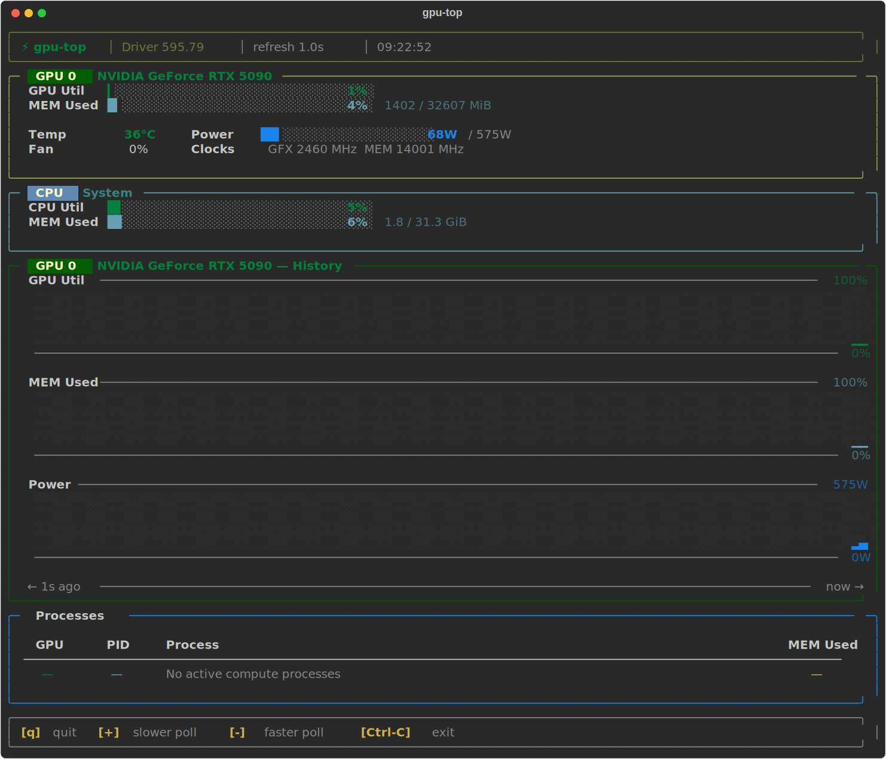

# gpu-top

A terminal GPU monitor for NVIDIA GPUs, inspired by nvtop. Parses `nvidia-smi`
output and renders a live full-screen dashboard with smooth progress bars,
rolling history sparklines, and a process table.



## Requirements

| Dependency | Version |
|---|---|
| Python | ≥ 3.10 |
| [rich](https://github.com/Textualize/rich) | ≥ 13.0 |
| NVIDIA driver + `nvidia-smi` | any recent |

## Setup

```bash
# Clone
git clone <repo-url> gpu-top
cd gpu-top

# Install (virtual env recommended)
python -m venv .venv && source .venv/bin/activate
pip install -r requirements.txt

# Run
python gpu_top.py
```

No root required. `nvidia-smi` must be on `PATH` (it always is if the NVIDIA
driver is installed).

## Usage

```
python gpu_top.py [--delay SEC] [--bar-width N]
```

| Flag | Default | Description |
|---|---|---|
| `-d`/`--delay SEC` | `1.0` | Poll interval in seconds (min 0.1) |
| `--bar-width N` | `30` | Width of the horizontal progress bars |

### Key bindings

| Key | Action |
|---|---|
| `q` / Ctrl-C | Quit |
| `+` | Increase poll interval (step 0.5 s above 1 s, 0.1 s below) |
| `-` | Decrease poll interval (same step logic, floor 0.1 s) |

## What's displayed

**GPU panel** — per-GPU utilization bar, memory bar (used / total MiB),
temperature, power draw vs. limit, fan speed, core and memory clock.

**History panel** — three 4-row block-character sparklines covering the last
120 samples: GPU utilization %, memory usage %, and power draw (W). The
time-span label tracks actual elapsed wall time, so it stays accurate when
you change the poll interval mid-session.

**Processes** — PID, process name, and VRAM used for every active compute
context. Fields that `nvidia-smi` cannot read (e.g., processes with no VRAM
visibility) show as `N/A` without crashing.

## Architecture

Everything lives in a single file (`gpu_top.py`).

A daemon thread polls `nvidia-smi` every `--delay` seconds, running two
parallel subprocesses (GPU metrics and compute-app list) and writing results
under a `threading.Lock`. The main thread reads a snapshot at up to 20 fps
and hands it to `rich.live.Live` which diffs and redraws only changed cells.
CPU overhead is negligible — two ~40 ms subprocess calls per second, with the
Python process otherwise idle.

## Development

```bash
pip install -r requirements-dev.txt   # adds pytest, pytest-mock, ruff

# Lint
ruff check gpu_top.py tests/

# Tests (106 cases, no GPU required — nvidia-smi is fully mocked)
pytest tests/ -v
```

CI runs on Python 3.10, 3.11, and 3.12 via GitHub Actions (`.github/workflows/ci.yml`).

## License

GNU General Public License v3.0 — see [LICENSE](LICENSE).
